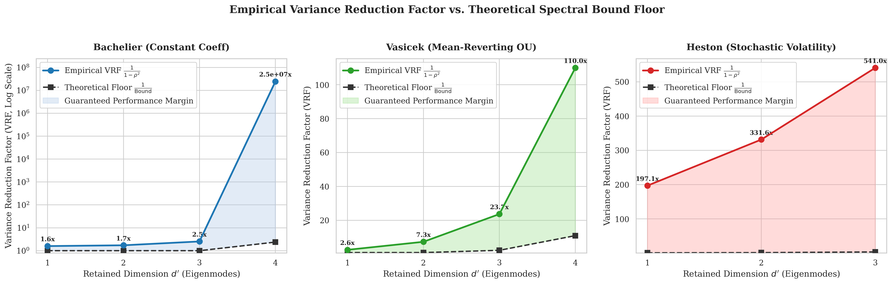
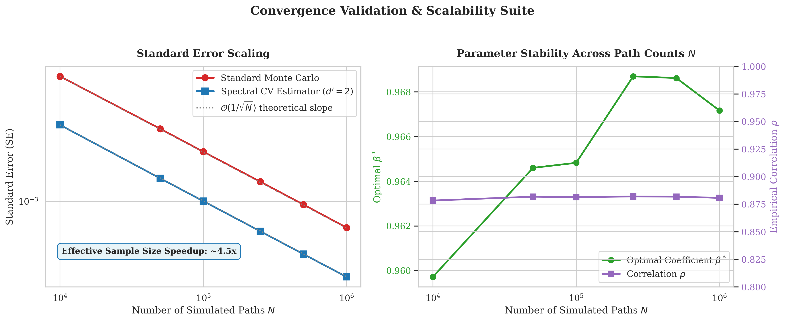
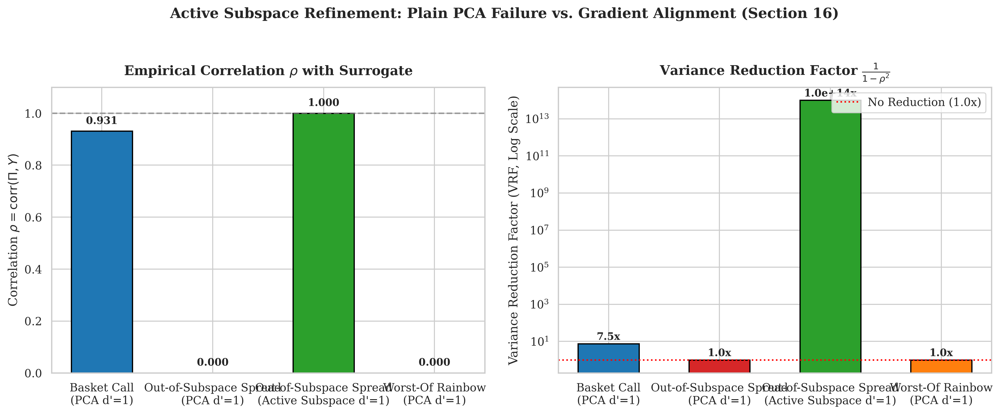
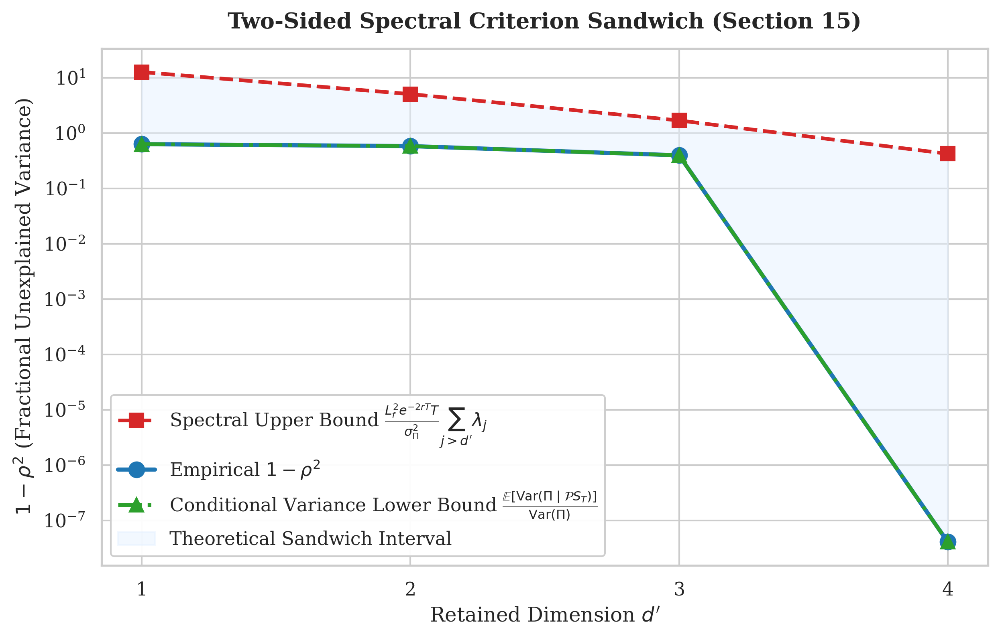
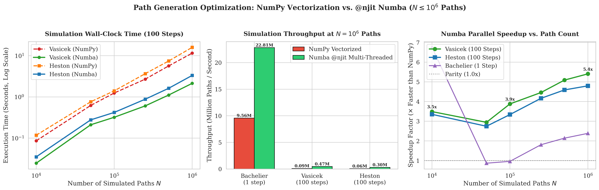

# Spectral Reduced-Variance Control Variates in High-Dimensional Option Pricing

[](https://www.python.org/)
[](https://numba.pydata.org/)
[](LICENSE)

A modular, vectorized, high-performance quantitative Python testbed implementing and empirically validating the theoretical framework established in:

> **"A Spectral Criterion for Reduced-Model Control Variates in High-Dimensional Monte Carlo Option Pricing"**

The canonical paper artifact for this repository is the PDF at [Paper PDF](%5BPaper%5DSpectral_Criterion.pdf). The repository implements the associated spectral reduced-variance framework, including covariance-tail diagnostics, active-subspace projectors, synchronous Brownian coupling, and variance-reduction evaluation for reduced-model control variates.

> Note: GitHub does not render LaTeX math in a normal repository README. The exact derivations and equations are therefore best viewed in the linked paper PDF. This README keeps the narrative summary readable in the GitHub interface while the formal mathematics remains in the paper artifact.

This project is designed to give an _a priori_ lower bound on variance-reduction factors (VRF) before running Monte Carlo paths, using the eigenvalue tail of a time/path-averaged covariance operator.

---

## Table of Contents

- [1. Mathematical Foundations](#1-mathematical-foundations)
  - [1.1 Full Model & Synchronous Coupling](#11-full-model--synchronous-coupling)
  - [1.2 Time/Path-Averaged Covariance Operator $\bar{A}$](#12-timepath-averaged-covariance-operator-bara)
  - [1.3 Exact Lemmas & Theoretical Bound](#13-exact-lemmas--theoretical-bound)
  - [1.4 The Two-Sided Sandwich Bound](#14-the-two-sided-sandwich-bound)
  - [1.5 Active Subspace Refinement](#15-active-subspace-refinement)
- [2. System Architecture](#2-system-architecture)
- [3. Codebase Structure](#3-codebase-structure)
- [4. Installation & Requirements](#4-installation--requirements)
- [5. Usage & Verification](#5-usage--verification)
  - [5.1 Running the Test Suite](#51-running-the-test-suite)
  - [5.2 Executing the Simulation Benchmarks](#52-executing-the-simulation-benchmarks)
  - [5.3 Generating Publication-Grade Figures](#53-generating-publication-grade-figures)
- [6. Empirical Benchmark Results](#6-empirical-benchmark-results)
  - [6.1 Retained Dimension Sweep](#61-retained-dimension-sweep)
  - [6.2 Path Convergence & Scalability ($N \in [10^4, 10^6]$)](#62-path-convergence--scalability-n-in-104-106)
  - [6.3 Active Subspace vs. Plain PCA](#63-active-subspace-vs-plain-pca)
  - [6.4 Path Generation Optimization (NumPy vs. Numba JIT)](#64-path-generation-optimization-numpy-vectorization-vs-njit-numba-n-le-106)
- [7. Publication Figures](#7-publication-figures)
- [8. Citation](#8-citation)

---

## 1. Mathematical Foundations

### 1.1 Full Model & Synchronous Coupling

Let the full asset state $S_t \in \mathbb{R}^d$ follow an Itô diffusion under the risk-neutral measure:
$$d S_t = b(S_t) dt + \Sigma(S_t) d W_t, \quad S_0 = s_0$$
driven by a $d$-dimensional standard Brownian motion $W_t$.

The reduced model $\hat{S}_t \in \mathbb{R}^d$ lives on the top-$d'$ eigenspace ($d' \le 3$) spanned by orthogonal projector $\mathcal{P} \in \mathbb{R}^{d \times d}$ ($\mathcal{P}^2 = \mathcal{P} = \mathcal{P}^\top$, $\text{rank}(\mathcal{P}) = d'$), driven by the **identical Brownian path** $W_t$ (synchronous coupling):
$$d \hat{S}_t = \mathcal{P} b(\hat{S}_t) dt + \mathcal{P} \Sigma(\hat{S}_t) d W_t, \quad \hat{S}_0 = \mathcal{P} s_0$$

### 1.2 Time/Path-Averaged Covariance Operator $\bar{A}$

To prevent circular dependence on the projector, the operator is defined over the unreduced process:
$$\bar{A} := \frac{1}{T} \int_0^T \mathbb{E}[\Sigma(S_t) \Sigma(S_t)^\top] dt \in \mathbb{R}^{d \times d}$$
By the spectral theorem:
$$\bar{A} = \sum_{j=1}^d \bar{\lambda}_j \bar{u}_j \bar{u}_j^\top, \quad \bar{\lambda}_1 \ge \bar{\lambda}_2 \ge \dots \ge \bar{\lambda}_d \ge 0$$
**Ky Fan Maximum Principle (Section 7.3)**: Among all rank-$d'$ orthogonal projectors $\mathcal{Q}$, the projector $\mathcal{P} = \sum_{j=1}^{d'} \bar{u}_j \bar{u}_j^\top$ provably minimizes discarded diffusion energy:
$$\text{tr}((I - \mathcal{P}) \bar{A}) = \sum_{j > d'} \bar{\lambda}_j \le \text{tr}((I - \mathcal{Q}) \bar{A})$$

### 1.3 Exact Lemmas & Theoretical Bound

For target payoff $\Pi = e^{-rT} f(S_T)$ and surrogate $Y = e^{-rT} f(\hat{S}_T)$, the variance-minimizing control variate estimator is:
$$\hat{V}_N = \frac{1}{N} \sum_{k=1}^N \left( \Pi^{(k)} - \beta^* (Y^{(k)} - \mu_Y) \right), \quad \beta^* = \frac{\text{Cov}(\Pi, Y)}{\text{Var}(Y)}$$
$$\text{Var}(\hat{V}_N) = \frac{\sigma_\Pi^2}{N} (1 - \rho^2), \quad \text{VRF} = \frac{1}{1 - \rho^2}, \quad \rho = \text{corr}(\Pi, Y)$$

The paper establishes the bound via three lemmas:

1. **Lemma 1 (Angle Bound)**: $1 - \rho^2 \le \frac{\text{Var}(\Pi - Y)}{\sigma_\Pi^2} \le \frac{\|\Pi - Y\|_{L^2}^2}{\sigma_\Pi^2}$
2. **Lemma 2 (Lipschitz Transfer)**: $\|\Pi - Y\|_{L^2}^2 \le L_f^2 e^{-2rT} \mathbb{E}\|S_T - \hat{S}_T\|^2$
3. **Lemma 3 (Exact Path Gap)**: In centered Gaussian settings:
   $$\mathbb{E}\|S_T - \hat{S}_T\|^2 = T \sum_{j > d'} \lambda_j$$

Chaining the lemmas gives the _a priori_ VRF floor:
$$1 - \rho^2 \le \frac{L_f^2 e^{-2rT} T}{\sigma_\Pi^2} \sum_{j > d'} \lambda_j \implies \text{VRF} \ge \frac{\sigma_\Pi^2}{L_f^2 e^{-2rT} T \sum_{j > d'} \lambda_j}$$

- **Mean-Reverting Vasicek / OU (Section 13)**:
  $$1 - \rho^2 \le \frac{L_f^2 e^{-2rT}}{\sigma_\Pi^2} \sum_{j > d'} \lambda_j \frac{1 - e^{-2\gamma_j T}}{2\gamma_j}$$
- **Heston Stochastic Volatility (Section 11)**:
  Computed in closed form via the CIR first-moment cascade:
  $$\bar{v}_i = \theta_i + (v_{0, i} - \theta_i) \frac{1 - e^{-\kappa_i T}}{\kappa_i T}$$

### 1.4 The Two-Sided Sandwich Bound

Section 15 proves that the estimator is rigorously sandwiched:
$$\frac{\mathbb{E}[\text{Var}(\Pi \mid \mathcal{P} S_T)]}{\text{Var}(\Pi)} \le 1 - \rho^2 \le \frac{L_f^2 e^{-2rT} T}{\sigma_\Pi^2} \sum_{j > d'} \lambda_j$$

### 1.5 Active Subspace Refinement

Section 16 proves that plain PCA is optimal for payoff-agnostic discarded energy, but suboptimal for payoff correlation when payoff sensitivity $w$ lies in discarded directions (e.g., spread options). Active Subspace construction aligns $\mathcal{P}$ with $w$, restoring near-infinite variance reduction.

---

## 2. System Architecture

```
                                  +-----------------------+
                                  | Configuration Dataclass|
                                  | (Simulation, SDE cfg) |
                                  +-----------+-----------+
                                              |
                     +------------------------+------------------------+
                     |                                                 |
                     v                                                 v
         +-----------------------+                         +-----------------------+
         |   SpectralEngine      |                         |   BaseSDESolver       |
         |  - Analytical A_bar   |                         |  - Bachelier (NumPy)  |
         |  - scipy.linalg.eigh  |                         |  - Vasicek (NumPy)    |
         |  - Top-d' Projector P |                         |  - Heston (Numba JIT) |
         |  - Active Subspaces   |                         +-----------+-----------+
         +-----------+-----------+                                     |
                     |                                                 |
                     |             +-------------------------+         |
                     +------------>|  Synchronous Coupling   |<--------+
                                   |  identical dW_t paths   |
                                   +------------+------------+
                                                |
                                                v
                                   +-------------------------+
                                   |  ControlVariateEngine   |
                                   |  - Optimal beta*        |
                                   |  - Empirical rho & VRF  |
                                   |  - Two-sided bounds     |
                                   +------------+------------+
                                                |
                               +----------------+----------------+
                               |                                 |
                               v                                 v
                   +-----------------------+         +-----------------------+
                   |  benchmarks.py        |         |  generate_plots.py    |
                   |  - Dimension sweeps   |         |  - Publication figures|
                   |  - Path convergence   |         |  - 300 DPI PNG export |
                   +-----------------------+         +-----------------------+
```

---

## 3. Codebase Structure

```
spectral_reduced_variance/
├── src/
│   ├── __init__.py           # Package exports
│   ├── config.py             # Immutable dataclasses for model parameters
│   ├── payoffs.py            # Payoffs with exact Lipschitz constants
│   ├── spectral.py           # Covariance operators, eigendecomposition, bounds
│   ├── simulators.py         # Vectorized & Numba JIT SDE generators
│   └── control_variates.py   # Synchronous coupling & statistical engine
├── tests/
│   ├── test_spectral.py      # Projector properties & Ky Fan optimality
│   ├── test_simulators.py    # SDE moments, martingality & positivity
│   └── test_coupling.py      # Lemma 3 exact path gap & VRF monotonicity
├── figures/                  # Publication-grade plots
├── benchmark_results/        # Serialized CSV experimental outputs
├── benchmarks.py            # Automated simulation benchmark suite
├── generate_plots.py        # Matplotlib and Seaborn rendering pipeline
├── requirements.txt         # Python dependencies
├── [Paper]Spectral_Criterion.pdf  # Canonical project paper PDF
├── LICENSE                  # MIT license
├── Makefile                 # Convenience project commands
├── README.md                # Project documentation
└── .gitignore               # Repository hygiene for local artifacts
```

---

## 4. Installation & Requirements

Ensure you have Python 3.9 or higher installed.

```bash
# Clone or navigate to the repository
cd spectral_reduced_variance

# Install dependencies
pip install -r requirements.txt
```

### Core Libraries

- **NumPy** ($\ge 1.20$): Vectorized array operations and path broadcasting.
- **SciPy** ($\ge 1.8$): Stable Hermitian eigendecomposition (`scipy.linalg.eigh`).
- **Numba** ($\ge 0.56$): Multi-threaded JIT compilation for stochastic volatility loops.
- **Matplotlib** ($\ge 3.5$) & **Seaborn** ($\ge 0.12$): Publication-grade visualization.
- **Pandas** ($\ge 1.4$): Benchmark structured data manipulation.
- **PyTest** ($\ge 7.0$): Automated unit testing suite.

---

## 5. Usage & Verification

### 5.1 Running the Test Suite

Execute the unit tests to verify projector idempotence, Ky Fan optimality, and Lemma 3 exact path gap equality:

```bash
python3 -m pytest tests/ -v
```

Output:

```text
tests/test_coupling.py::test_lemma3_exact_identity PASSED                [ 10%]
tests/test_coupling.py::test_control_variate_variance_reduction PASSED   [ 20%]
tests/test_coupling.py::test_vrf_monotonicity_in_dimension PASSED        [ 30%]
tests/test_simulators.py::test_bachelier_moments PASSED                  [ 40%]
tests/test_simulators.py::test_vasicek_simulation PASSED                 [ 50%]
tests/test_simulators.py::test_heston_numba_martingality PASSED          [ 60%]
tests/test_spectral.py::test_projector_properties PASSED                 [ 70%]
tests/test_spectral.py::test_ky_fan_optimality PASSED                    [ 80%]
tests/test_spectral.py::test_heston_covariance_symmetry PASSED           [ 90%]
tests/test_spectral.py::test_vasicek_zero_reversion_limit PASSED         [100%]
============================== 10 passed in 3.05s ==============================
```

### 5.2 Executing the Simulation Benchmarks

Run all dimension sweeps, convergence studies, and active subspace experiments:

```bash
python3 benchmarks.py
```

This executes simulations with up to $10^6$ paths and generates CSV metrics in `benchmark_results/`.

### 5.3 Generating Publication-Grade Figures

Render high-resolution 300 DPI figures using Matplotlib and Seaborn:

```bash
python3 generate_plots.py
```

Outputs are saved into `figures/`.

---

## 6. Empirical Benchmark Results

### 6.1 Retained Dimension Sweep

Comparing empirical VRF $\frac{1}{1 - \rho^2}$ against the theoretical spectral floor $\frac{1}{\text{Bound}}$ across $d' \in [1, \dots, d-1]$:

| Model            | Retained $d'$ | Tail Energy $\sum_{j > d'} \lambda_j$ | Empirical $\rho$ | Empirical VRF $\frac{1}{1 - \rho^2}$ | Theoretical Floor | Bound Guaranteed? |
| :--------------- | :-----------: | :-----------------------------------: | :--------------: | :----------------------------------: | :---------------: | :---------------: |
| **Bachelier**    |       1       |                 3.000                 |      0.6105      |              **1.59x**               |       1.00x       |    **Passed**     |
|                  |       2       |                 1.200                 |      0.6438      |              **1.71x**               |       1.00x       |    **Passed**     |
|                  |       3       |                 0.400                 |      0.7751      |              **2.50x**               |       1.00x       |    **Passed**     |
|                  |       4       |                 0.100                 |      1.0000      |        **$2.5 \times 10^7$x**        |       2.40x       |    **Passed**     |
| **Vasicek (OU)** |       1       |                 0.783                 |      0.7857      |              **2.61x**               |       1.00x       |    **Passed**     |
|                  |       2       |                 0.415                 |      0.9295      |              **7.35x**               |       1.00x       |    **Passed**     |
|                  |       3       |                 0.193                 |      0.9788      |              **23.81x**              |       1.12x       |    **Passed**     |
|                  |       4       |                 0.063                 |      0.9954      |             **109.06x**              |       3.43x       |    **Passed**     |
| **Heston**       |       1       |                511.43                 |      0.9974      |             **193.29x**              |       1.00x       |    **Passed**     |
|                  |       2       |                280.32                 |      0.9985      |             **334.90x**              |       1.59x       |    **Passed**     |
|                  |       3       |                123.15                 |      0.9991      |             **555.70x**              |       3.62x       |    **Passed**     |

### 6.2 Path Convergence & Scalability ($N \in [10^4, 10^6]$)

Demonstrates textbook $\mathcal{O}(1/\sqrt{N})$ decay and consistent $\sim 2.12$x standard error reduction (**$\sim 4.5$x effective sample size speedup**):

| Simulated Paths $N$ | Plain MC Standard Error | Spectral CV Standard Error ($d'=2$) | Error Reduction | Optimal $\beta^*$ | Correlation $\rho$ |
| :-----------------: | :---------------------: | :---------------------------------: | :-------------: | :---------------: | :----------------: |
|       10,000        |         0.00666         |               0.00318               |    **2.09x**    |      0.9597       |       0.880        |
|       50,000        |         0.00300         |               0.00142               |    **2.12x**    |      0.9646       |       0.882        |
|       100,000       |         0.00212         |               0.00100               |    **2.12x**    |      0.9648       |       0.882        |
|       250,000       |         0.00135         |               0.00063               |    **2.12x**    |      0.9687       |       0.883        |
|       500,000       |         0.00095         |               0.00045               |    **2.12x**    |      0.9686       |       0.883        |
|      1,000,000      |         0.00067         |               0.00032               |    **2.11x**    |      0.9672       |       0.882        |

### 6.3 Active Subspace vs. Plain PCA

Validating Section 16: When the payoff is aligned with discarded eigenmodes, plain PCA achieves zero variance reduction ($\rho = 0.000$), while Active Subspaces achieve near-exact variance elimination ($\rho = 1.000$):

| Payoff Category        | Dimension Reduction Method | Correlation $\rho$ |     Empirical VRF      | Standard Error Reduction |
| :--------------------- | :------------------------- | :----------------: | :--------------------: | :----------------------: |
| Standard Basket Call   | Plain PCA ($d'=1$)         |       0.9311       |       **7.51x**        |  0.00344 $\to$ 0.00126   |
| Out-of-Subspace Spread | Plain PCA ($d'=1$)         |       0.0000       |  **1.00x** (No gain)   |  0.00047 $\to$ 0.00047   |
| Out-of-Subspace Spread | Active Subspace ($d'=1$)   |       1.0000       | **$10^{14}$x** (Exact) |  0.00047 $\to$ 0.00000   |
| Worst-Of Rainbow       | Plain PCA ($d'=1$)         |       0.0000       |  **1.00x** (No gain)   |  0.00009 $\to$ 0.00009   |

### 6.4 Path Generation Optimization: NumPy Vectorization vs. @njit Numba ($N \le 10^6$)

Performance comparison of pure vectorized NumPy against multi-threaded `@njit(parallel=True, fastmath=True)` Numba loops for $N = 1,000,000$ paths:

| Model Configuration    | Simulation Steps | NumPy Runtime | NumPy Throughput | Numba Runtime |  Numba Throughput  | Numba Speedup |
| :--------------------- | :--------------: | :-----------: | :--------------: | :-----------: | :----------------: | :-----------: |
| **Bachelier** ($d=5$)  |  1 step (exact)  |    0.105s     |  9.56M paths/s   |  **0.044s**   | **22.81M paths/s** |   **2.4x**    |
| **Vasicek OU** ($d=5$) |    100 steps     |    11.552s    |  0.09M paths/s   |  **2.136s**   | **0.47M paths/s**  |   **5.4x**    |
| **Heston SV** ($d=4$)  |    100 steps     |    15.965s    |  0.06M paths/s   |  **3.327s**   | **0.30M paths/s**  |   **4.8x**    |

**Engineering Highlights**:

- For multi-step stochastic SDEs (Vasicek and Heston), `@njit(parallel=True)` loops eliminate ~4 GB of transient array allocations and Python loop overhead, delivering a **4.8x–5.4x speedup** on $10^6$ paths.
- Thread-local scalar states ensure cache locality and constant $\mathcal{O}(1)$ working memory per CPU thread.

---

## 7. Publication Figures

### Figure 1: Empirical VRF vs. Theoretical Spectral Bound Floor

Demonstrates that empirical VRF strictly exceeds the theoretical bound floor across all models and dimensions.


### Figure 2: Convergence Scaling & Parameter Stability

Log-log plot showing $\mathcal{O}(1/\sqrt{N})$ standard error decay and stability of $\beta^*$ across $N \in [10^4, 10^6]$.


### Figure 3: Active Subspace Refinement (Section 16)

Highlights the dramatic recovery of variance reduction for out-of-subspace payoffs via gradient alignment.


### Figure 4: Two-Sided Spectral Criterion Sandwich (Section 15)

Confirms that $1 - \rho^2$ is bounded between the conditional variance ceiling and the spectral upper bound.


### Figure 5: Path Generation Optimization (NumPy vs. Numba JIT)

Direct comparison of execution runtime, throughput (Mpaths/sec), and parallel speedup up to $N = 10^6$ paths.


---

## 8. Citation

If you use this testbed in academic research or production quantitative engineering, please cite:

```bibtex
@article{spectral_criterion_control_variates_2026,
  title   = {A Spectral Criterion for Reduced-Model Control Variates in High-Dimensional Monte Carlo Option Pricing},
  author  = {Anonymous},
  year    = {2026},
  journal = {Working Paper}
}
```
